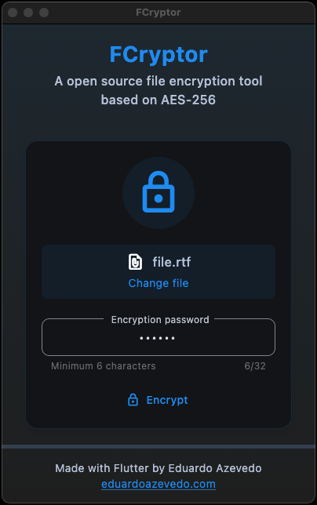

# FCryptor

  
  

    FCryptor is a cross-platform file encryption application built with Flutter. It provides a secure way to encrypt and decrypt files across different platforms, including web and desktop environments.
  

## Features

- File encryption and decryption
- Cross-platform support (Mobile, Web, Desktop)
- Secure password-based encryption (AES-256)
- Simple and intuitive user interface
- Native file picker integration

## Screenshots

  
  
  

